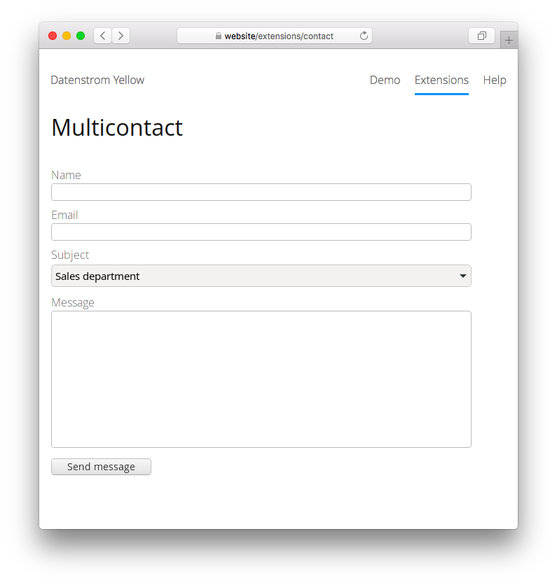

# Multicontact 0.9.1

Email contact form with multiple addresses.

<p align="center"></p>

## How to install an extension

[Download ZIP file](https://github.com/GiovanniSalmeri/yellow-multicontact/archive/refs/heads/main.zip) and copy it into your `system/extensions` folder. [Learn more about extensions](https://github.com/annaesvensson/yellow-update).

## How to use Multicontact

To show a contact form on any page use a [multicontact] shortcut. The webmaster, whose email is defined in file `system/extensions/yellow-system.ini`, receives all contact messages. A different `Author` and `Email` can be set [at the top of the page](https://github.com/annaesvensson/yellow-core#settings-page). In order to have different recipients for different subjects, you can use this optional argument in the shortcut, repeated how many times you wish:

`subject email` = subject and email, separated by a space and enclosed in quotes (e.g. `"Sales department sales@example.org"`)

## Examples

Showing a simple contact form in a page:

```
[multicontact]
```

Showing a contact form with different subjects and email addresses:

```
[multicontact "Sales department sales@example.org" "Consumer complaints complaints@example.org"]
```

## Settings

The following setting can be configured in file `system/extensions/yellow-system.ini`:

`MulticontactAjax` = use AJAX for contact form  

## Developer

Giovanni Salmeri. [Get help](https://datenstrom.se/yellow/help/).
